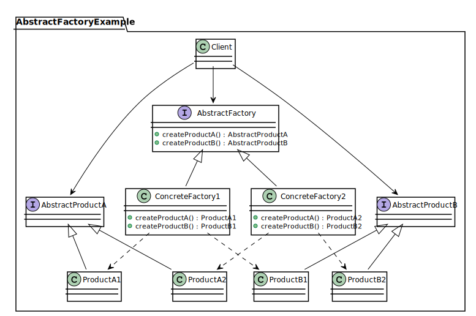
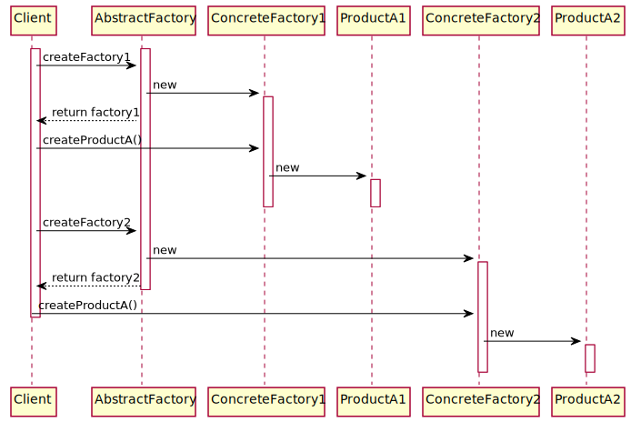
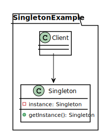
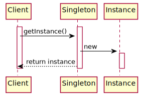

*[Отчет](https://github.com/rovany706/design-patterns/blob/master/AbstractFactoryAndSingleton/docs/Report.pdf)* | *[Код (Абстрактная фабрика)](https://github.com/rovany706/design-patterns/tree/Abstract-factory/AbstractFactoryAndSingleton/src/ru/ryazanov/HSE)* | *[Код (Одиночка)](https://github.com/rovany706/design-patterns/tree/master/AbstractFactoryAndSingleton/src/ru/ryazanov/HSE)*
# Паттерн "Абстрактная фабрика"
Абстрактная фабрика — это порождающий паттерн проектирования, который позволяет создавать семейства связанных объектов, не привязываясь к конкретным классам создаваемых объектов.

*Диаграмма классов*

*Диаграмма последовательности*

# Паттерн "Одиночка"
Одиночка — это порождающий паттерн проектирования, который гарантирует, что у класса есть только один экземпляр, и предоставляет к нему глобальную точку доступа.

*Диаграмма классов*

*Диаграмма последовательности*
