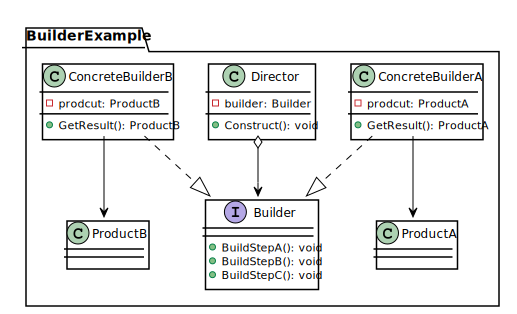
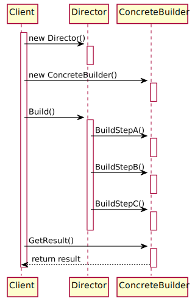

# Паттерн "Строитель"
Строитель — это порождающий паттерн проектирования, который позволяет создавать сложные объекты пошагово. Строитель даёт возможность использовать один и тот же код строительства для получения разных представлений объектов.

*Диаграмма классов*

*Диаграмма последовательности*

## Ссылки
1. [Отчет](https://github.com/rovany706/design-patterns/blob/master/Builder/docs/Report.pdf)
2. [Код](https://github.com/rovany706/design-patterns/tree/master/Builder/src/com/Builder)
