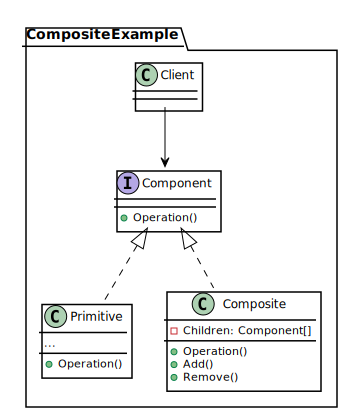
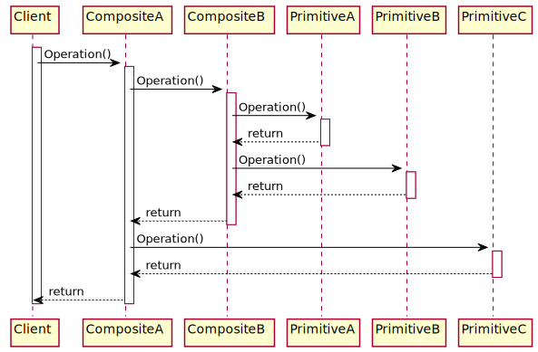

*[Отчет](https://github.com/rovany706/design-patterns/blob/master/Composite/docs/Report.pdf)* | *[Код](https://github.com/rovany706/design-patterns/tree/master/Composite/src/com/Builder)*
# Паттерн "Компоновщик"
Компоновщик — это структурный паттерн проектирования, который позволяет сгруппировать множество объектов в древовидную структуру, а затем работать с ней так, как будто это единичный объект.

*Диаграмма классов*

*Диаграмма последовательности*

