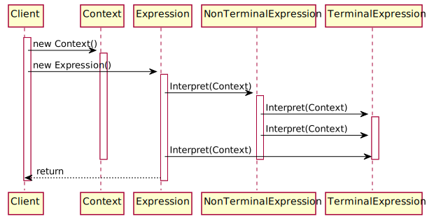

*[Отчет](https://github.com/rovany706/design-patterns/blob/master/Interpreter/docs/Report.pdf)* | *[Код](https://github.com/rovany706/design-patterns/tree/master/Interpreter/BrainfuckInterpreter)*
# Паттерн "Интерпретатор"
Интерпретатор — это поведенческий паттерн проектирования, определяющий представление грамматики для заданного языка и интерпретатор предложений этого языка. Как правило, данный шаблон проектирования применяется для часто повторяющихся операций.

*Диаграмма классов*

*Диаграмма последовательности*

