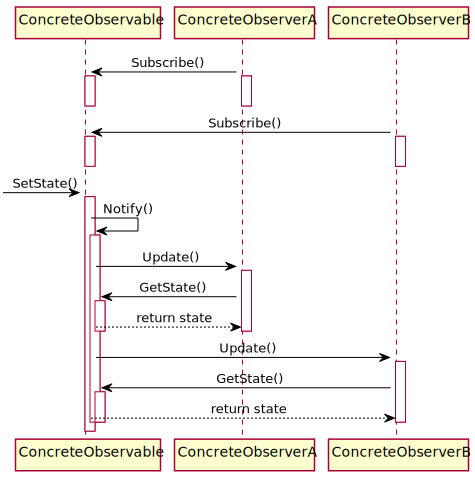

*[Отчет](https://github.com/rovany706/design-patterns/blob/master/Observer/docs/Report.pdf)* | *[Код](https://github.com/rovany706/design-patterns/tree/master/Observer/ObservableStudentJournals)*
# Паттерн "Наблюдатель"
Наблюдатель — это поведенческий паттерн проектирования, который создаёт механизм подписки, позволяющий одним объектам следить и реагировать на события, происходящие в других объектах.

*Диаграмма классов*

*Диаграмма последовательности*

