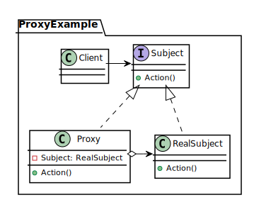
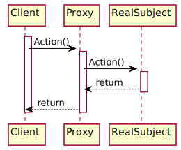

*[Отчет](https://github.com/rovany706/design-patterns/blob/master/Proxy/docs/Report.pdf)* | *[Код](https://github.com/rovany706/design-patterns/tree/master/Proxy/src/com/Proxy)*
# Паттерн "Заместитель"
Заместитель — это структурный паттерн проектирования, который позволяет подставлять вместо реальных объектов специальные объекты-заменители. Эти объекты перехватывают вызовы к оригинальному объекту, позволяя сделать что-то до или после передачи вызова оригиналу.

*Диаграмма классов*

*Диаграмма последовательности*

